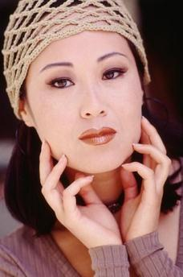
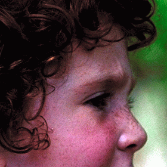

# SuperRestoration
Include：SRCNN、FSRCNN、SRResNet、SRGAN

# Introduce
## Why wrote this?
There are many ***Pytorch*** implementations of these networks on the web, but they do not appear exactly as described in the paper, so the results are quite different from the paper.
So I've provided a version that's as close to the paper as possible.  
Hopefully it will help those interested in **Super-Resolution** networks get started.  
For more details:https://zhuanlan.zhihu.com/p/431724297
# Install
You can clone this repository directly, and run it without installing.

## Running Enviroment
* Pytorch 3.7 64bit  
* Windows 10

## Reference
Because `bicubic` interpolation in python is different with matlab, 
but in paper use matlab to generate datasets and evaluate PSNR, so I found a ***Python*** implementations of ***Matlab*** function:`imresize()`.  
[Here is the author's repository.](https://github.com/fatheral/matlab_imresize.git)  
Similiarly, I give a python version of the `rgb2ycbcr()` and `ycbcr2rgb()` in matlab.

# Usage
## Prepare Datasets
* Run `data_aug.py` to augment datasets.  
* Run `gen_datasets.py` to generate trainning and validation data. (You may need to modify parameters in `config`.)
## Train
Take **SRCNN** as an example, run `SRCNN_x2.py` to train SRCNN. You can modify the training parameters according to your needs follow this template.
## Test
Run `test.py` to generate test result and calculate PSNR. (You can modify parameters to specify testsets.)
## Visualize
Run `csv2visdom.py` can visualize converge curve with visdom. (You need to install `visdom` and run it in advance.)  
Then visit `localhost:8097`.

# Result: PSNR
## SRCNN x3
|   |Paper| Ours|
----|---|---|
baby|35.01|34.96|
bird|34.91|34.95|
butterfly|27.58|27.77|
head|33.55|33.51|
woman|30.92|30.99|
| |32.39|32.43|

|   |Paper| Ours |  
----|-----|------|
baboon|23.60|23.60|
barbara|26.66|26.71|
bridge|25.07|25.08|
coastguard|27.20|27.17|
comic|24.39|24.42|
face|33.58|33.54|
flowers|28.97|29.01|
foreman|33.35|33.32|
lenna|33.39|33.40|
man|28.18|28.18|
monarch|32.39|32.54|
pepper|34.35|34.24|
ppt3|26.02|26.14|
zebra|28.87|28.80|
| |29.00|29.01|

## FSRCNN x3
Train on 91-images.

|   |Paper| Ours|
----|---|---|
Set5|33.06|33.06|
Set14|29.37|29.35|
BSDS200|28.55|28.95|

## SRResNet x4
Train on DIV2K.

|   |Paper| Ours|
----|---|---|
Set5|32.05|32.12|
Set14|28.49|28.50|
BSDS100|27.58|27.54|

## SRGAN x4
Train on DIV2K.

|   |Paper| Ours|
----|---|---|
Set5|29.40|30.19|
Set14|26.02|26.94|
BSDS100|25.16|25.82|

SRGAN cannot be evaluated by PSNR alone, so I list some test result.  
Obviously, SRGAN generates a sharper results than SRResNet and looks more convincing.

|bicubic|SRResNet|SRGAN|original|
---|---|---|---|
|||
|||
|||
|||
|||
|||
|||

